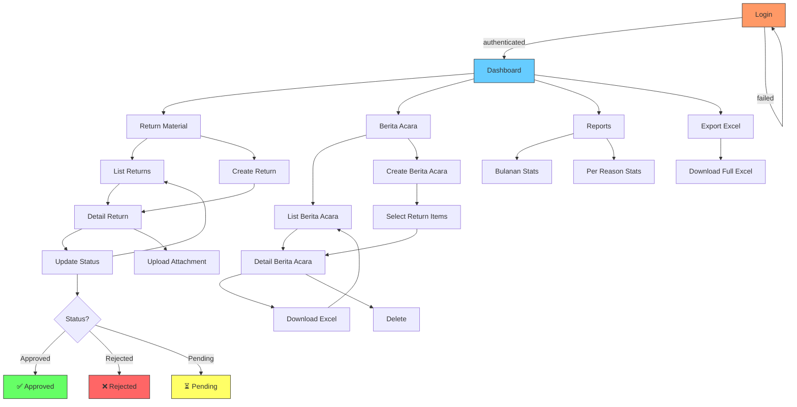

# Return Material Manager

Aplikasi web untuk mengelola return material — input data return, pelacakan status, laporan bulanan, dan cetak berita acara (Excel).

## Tech Stack

- **Backend:** FastAPI + SQLAlchemy + SQLite
- **Frontend:** Jinja2 + HTMX + TailwindCSS
- **Migration:** Alembic
- **Export:** openpyxl (Excel)

## Fitur

- **CRUD Return Material** — input lot ref, qty, reason, condition, destination, note
- **Status Tracking** — pending → approved → rejected
- **Attachment** — upload file pendukung per return
- **Berita Acara** — generate & export berita acara ke Excel (.xlsx)
- **Reports** — statistik return bulanan & per reason
- **Auth** — session-based login (default: `admin` / `admin123`)

## Flowchart



## Setup

```bash
# Clone
git clone https://github.com/andrizpray/Return-material.git
cd Return-material

# Virtual env
python3 -m venv venv
source venv/bin/activate

# Install deps
pip install -r requirements.txt

# DB migration
alembic upgrade head

# Run
uvicorn app.main:app --host 0.0.0.0 --port 8082
```

Buka `http://localhost:8082`

## Default Login

| Username | Password |
|----------|----------|
| admin    | admin123 |

> ⚠️ Ganti password sebelum deploy ke production.

## Struktur

```
app/
├── main.py              # App entry, middleware, seed admin
├── config.py            # Settings (DB path, upload dir, pagination)
├── database.py          # SQLAlchemy engine & session
├── models/
│   └── models.py        # User, ReturnMaterial, ReturnReason, ReturnAttachment, BeritaAcara, AuditLog
├── routes/
│   ├── auth.py          # Login / logout
│   ├── returns.py       # CRUD return material
│   ├── berita_acara.py  # Berita acara + Excel export
│   ├── reports.py       # Laporan bulanan
│   ├── dashboard.py     # Dashboard utama
│   └── export.py        # Export data
├── static/              # CSS, JS, images
└── templates/           # Jinja2 HTML templates
alembic/                 # Database migrations
data/                    # SQLite database (gitignored)
uploads/                 # File attachments (gitignored)
```

## License

MIT
